---
# Mealdeals Errors #
---
* [Build Errors](#BuildErrors)
* [Carousel Errors](#user-goals)
* [Deal Detail Errors](#DealDetailErrors)
* [Products Errors](#ProductsErrors)
* [Query Issues](#QueryIssues)

---
**During development**
---
As I had afew learning curves by using Django frameworks there was alot of errros I needed to work through and understand, I wanted to document a lot of my learning opportunities through this project.

* I had a major issue with my Admin Sqlite DB file whilst setting up the database because of this issue:  

---
## Errors ##
---

---

### Build Errors ###
---

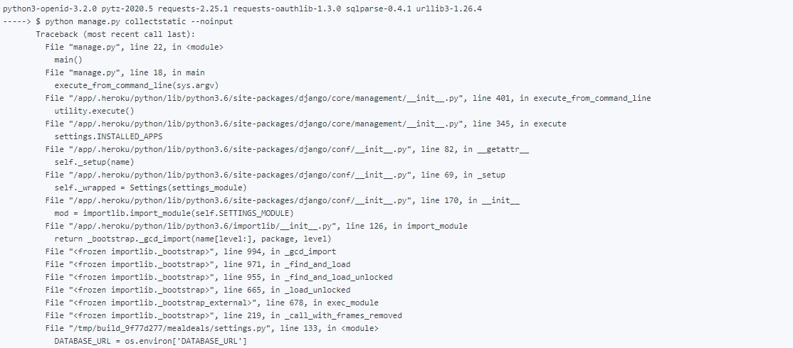
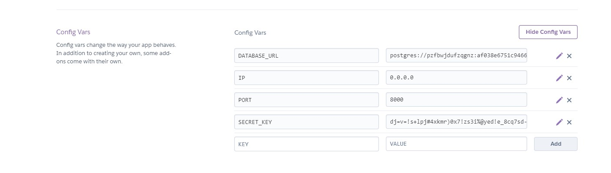

---

### Carousel Errors ###
---

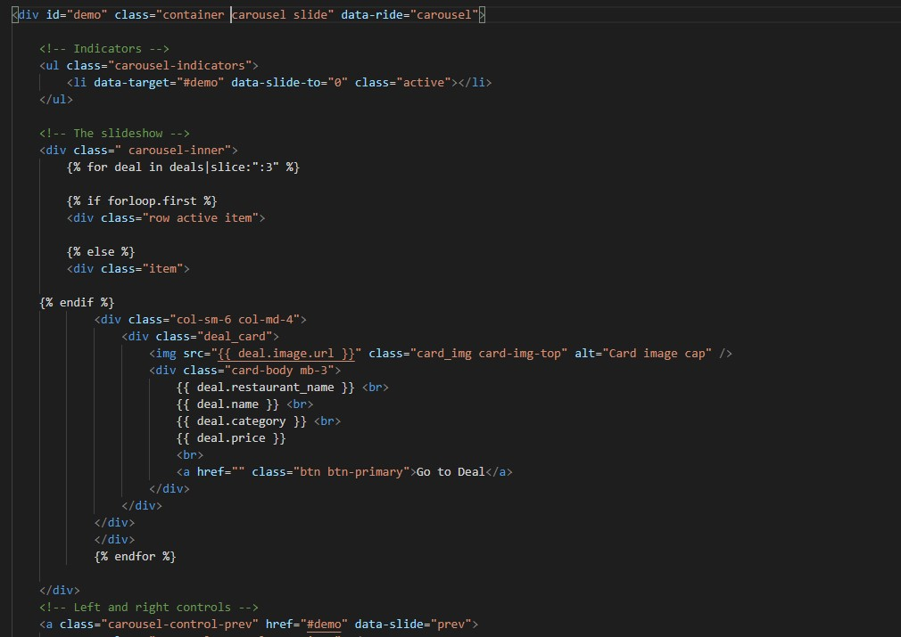
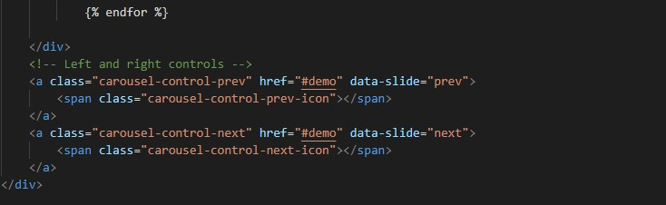

---

### Deal Detail Errors ###
---

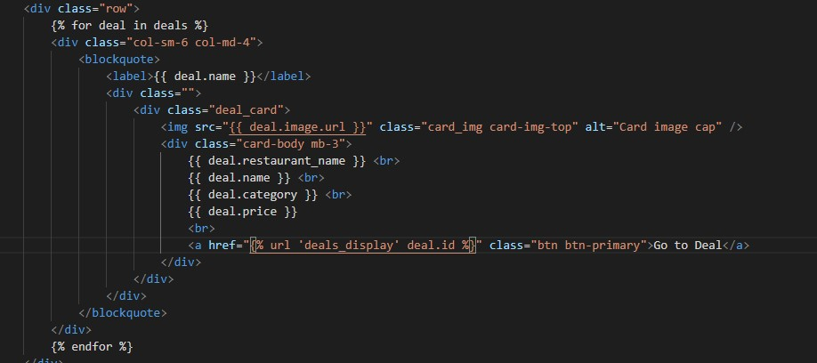
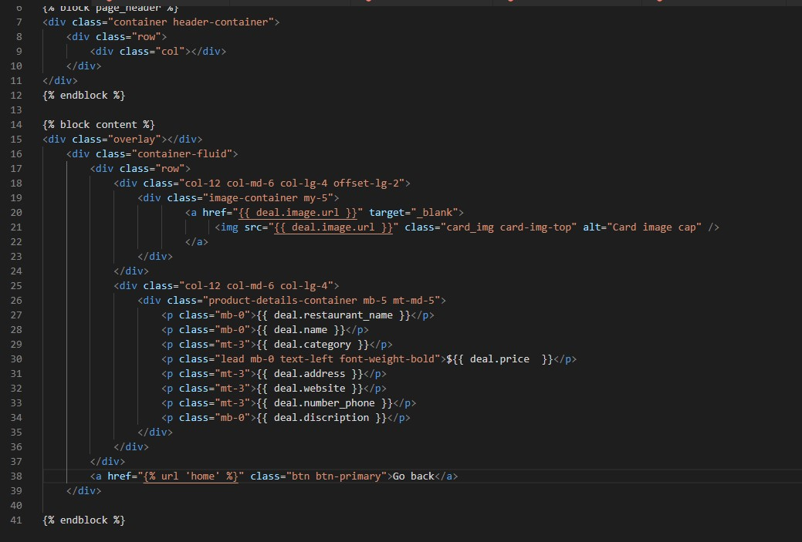
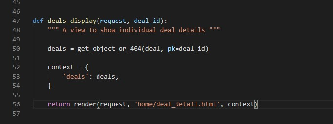
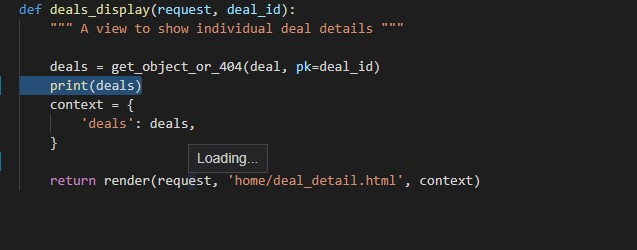
SOLVE
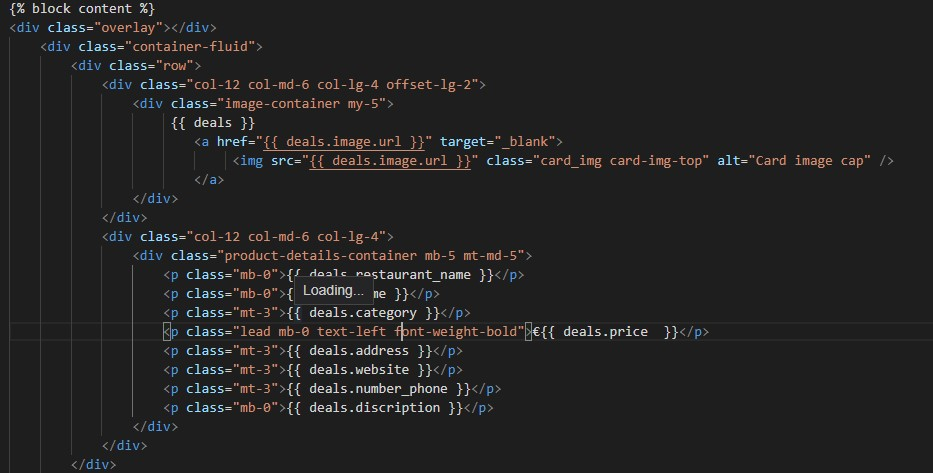

---

### Products Errors ###
---

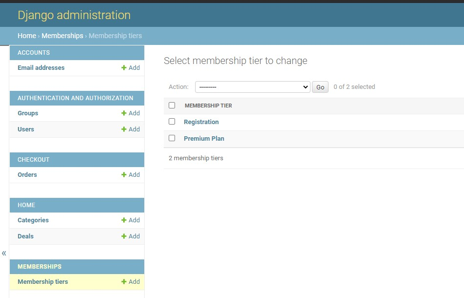
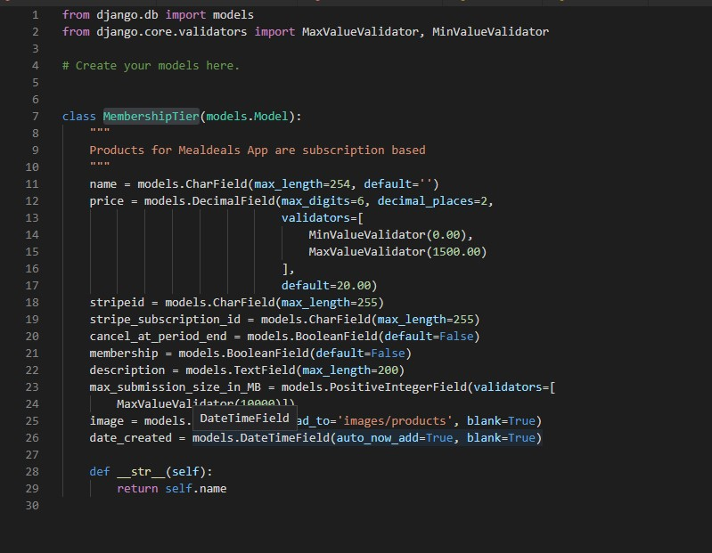

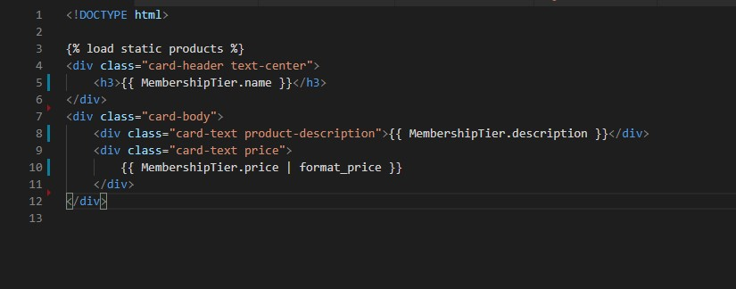
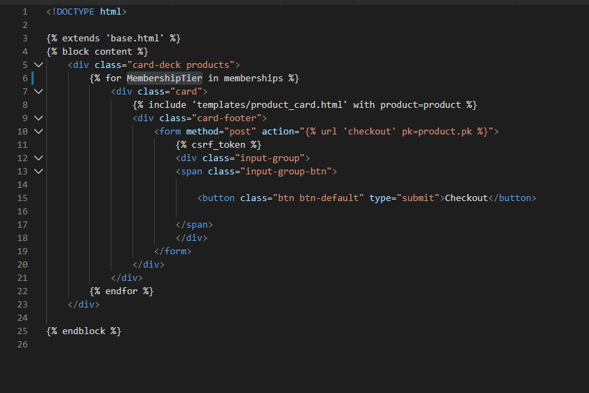

---

### Query Issues ###
---

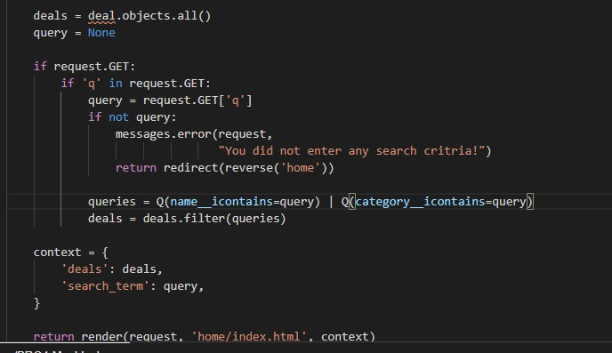
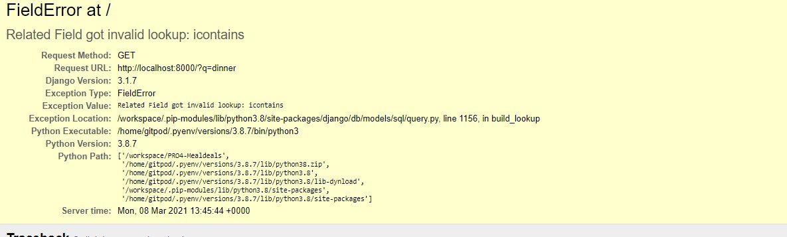
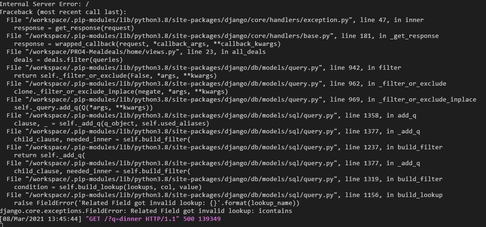
