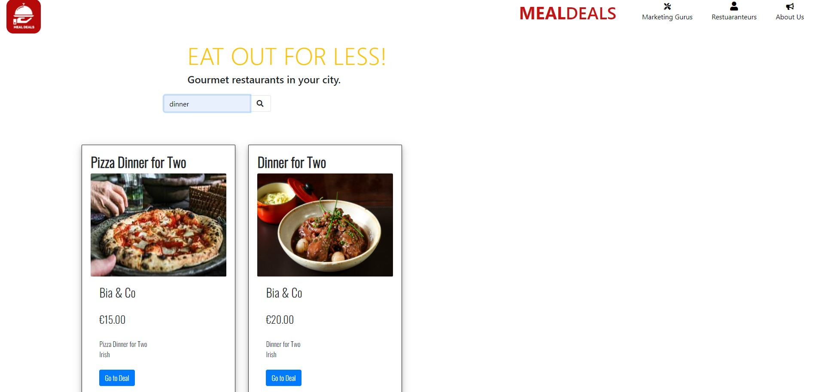
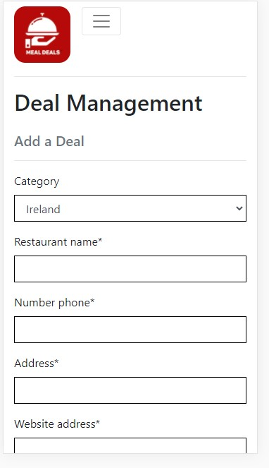

---
# Mealdeals #
---

---

## Contents ##
---

* [UX](#User-Experience)
    * [Project Goals](#project-goals)
    * [User Goals](#user-goals)
    * [User Stories](#user-stories)
    * [User Requirements and Expectations](#requirements)
    * [Design Choices](#design-choices)
        * [Fonts](#fonts)
        * [Icons](#icons)
        * [Colors](#colors)
* [Structure](#structure)
    * [Page Structure](#page_structure)
        * [Home Page](#home_page)
        * [Browsing](#browsing)
        * [Detailed View](#detailed_view)
    * [Database and schema](*db_schema)
        * [Schemas](*schemas)
        * [Database](*db)
    * [Wireframing](#wireframing)
    * [Design and Layout](#design)
* [Features](#features)
    * [Features that have been developed](#developed)
    * [Features that will be implemented in the future](#implemented)
* [Technologies](#technologies)
* [Testing](#testing)
    * [Responsiveness](#Responsiveness)
* [Troubleshooting](#issues)
* [Deployment](#deploy)
* [Credit](#credits)

---
---

## UX (User Experience) ##
---
---

### Project Goals ###
---

This website is designed so that restaurants can have a space to advertise their deals, and bring foot traffic through their doors 

The **goal** for this project is to allow restaurants the ability to advertise their restaurant and their ideas on a platform which is not social media.  
The website also gives the restaurants the access to change their deals without any hassle, but most important it is a place where the restaurants are charged
a flat rate for monthly subscriptions instead of being "charged per voucher" bought and have a portion of their hard earned profit put towards bringing in people.

---

### User Goals ###
---

For the UX on this project I wanted to create a simple and user friendly site. My target audience is young and mature adults.  
The site also allows for restaurant customers to find good and decent deals in their area!!

#### Scope ####
* An Eye catching landing page
* Mass-displaying all or filtered deals. Lines of relatively small images, with option to click and view or like
* Search, filter and sort deals.
* Detailed profile for restaurateurs on top of the simple registration.
* Dedicated page for uploading new deals
* Checkout with card payment.
* Full page Deal view including the Name of the restaurant, address and contact details as well as the Deal description, price and valid till, options.
* Legal framework is also included, with links to privacy policies and FAQs, as well as corporate info in the about us section of the website.

#### Clients ####
* **View specific deals** with **quick searches** within the **Category and Area** they are looking for, instead of searching through all the deals.
* **Being excited** to find new deals and **share** these deals with their friends.
* **View** the full list of deals on the home page
* **Find company info** from the deal such as name of restaurant, address, telephone number, website
* **View individual deal Info** from the deal such as T&C's, price, and end time for the promotion 
* **Contact us** for expert marketing advice and we will design any deals for you at a small fee.
 

#### Restaurant Management Profiles ####
* Easily **Register & Create** a Profile, having a restaurant specific profile.
* Easily **Login or Logout** access to account information
* Easily **recover my password** in case I forget it.
* Receive **an Email confirmation** to verify that my account registration was successful.
* **Easily** pay for the subscription costs on signing up
* **Receive** and email confirmation of purchase to keep for records and accounting.
* **Add, Edit and Delete** Company information as needed in a **personalized User profile**
* **Add, Edit and Delete** Deals periodically

#### Out of Scope topics ####
* order processing after checkout and the bag was excluded, as one of the steps in the payment journey.
* Potential further features:

    * Coupon code for promotions,
    * Discount for multi-buys.
* Marketing the site itself and utilising advertising opportunities within the site is out of scope, therefore the links to social media sites are home based links.

---

### User Stories ### 
---

* The **Clients user** wants an **attractive website** with a **non-distracting** background.
* The **Clients user** wants to see **clear instructions** on how to drill down into further information on deals within the website.
* The **Clients user** wants there to be a **search box** so that the user can quickly identify **deals**.
* The **Clients user** wants to be able to **sort by** categories or restaurant name.
* The **Clients user** wants to start **finding deals immediately**. 
* The **Clients user** wants to see the **latest deals** added.
* The **Clients user** wants a **convenient sized deal box** to be able to read the Deal clearfully.
* The **Clients user** wants to know the **Deals** details such as **T&C's, price, and end time** for the promotion.
* The **Clients user** wants to get a maximum of advantage of the **Mealdeals cloud**.
 
* The **Admin user** wants to know the **time period** of the deal before **deciding** on continuing with the specific deal.
* The **Admin user** wants to **have the possibility** of their **own profile** where their deals come up first.
* The **Admin user** wants to **know** if **their Deals has been submitted**.
* The **Admin user** wants to know the **deals** details such as **name of restaurant, address, telephone number, website**
* The **Admin user** wants to **easily add, edit and delete their own Deals** on the website.
* The **Admin user** wants to **have the possibility** to **upload pictures**.

---

### Research ###
---

* When developing this **website**, I kept in mind that the aesthetic should be inspired by similar Deal and coupon hubs on the internet. 
* I tried to create a **simple and easy feel** to for a cleaner approach for the landing page.
* I checked **previously made coupon websites** such as [**groupon.ie**](https://www.groupon.ie//) and used **my own experience** as a trained chef and restaurateur.

Product:

---

### Design Choices ###
---

### Fonts ###

* The **landing page** is using the classic website **Google Fonts** **#** for the H1 and H3. 
* I paired it with the **Google Fonts** **Crimson & Oswald** for readability.
* I kept the **Oswald** font for **better user experience**

### Icons and Images ###

* The **Favicon** used on the website are provided by [**Canva**](https://canva.com/) and called by using url_for.
* The **image** used for the **landing page** is a created **image** from the image bank [**Canva**](https://canva.com/). 

### Colors ###

* The **color scheme** used for the website is a sleek **deal website palette** composed of a combination of **Red and whites** 
* For the **title** and the **logo** I used a **dark burgundy red** on the **a white background**.
* I specifically chose these colors as Red is a colour that stimulates appetite in humans, but I wanted it a dark red as I still wanted to convey a relaxed atmosphere.

---
---

## Structure ##
---
---

### Page Structure ###
---

#### Home page ####

There are two types of users and I wanted to give a clear path to start using the site with Call To Action for both groups. Potential deal shoppers are directed to the Search & browsing, while potential restuaranteurs are shown an eye-catchy banner with a popping CTA button.

#### Browsing ####

Many similar sites (competitors) are trying to showcase a wide range of services and options, therefore losing focus and probably losing potential subscriptions and users by not inviting them to further explore the site. My clear goal here is to lead users to check out more deals.

#### Detailed view ####

Clicking on any of the deals on the home page brings the user to the deal details page, displaying all the available information about each deal. 

#### Potential contributors ####
Potential contributors have a flow of action to fully utilize the page and achieve their goals. They have a strictly limited access to the part of the database that concerns their artwork and therefore can perform CRUD operations.

* Create new entry: upload image and provide details
* Read (Display) entries - the detailed view with personal information
* Update entries - making changes to their existing records
* Delete entries – delete items from the database 

---

### Database and schema ###
---
I put quite some effort into designing the database structure and schema. It was a difficult activity for me as I have never really done this before (the schema for my previous Flask based project with Code Institute was rather very simple).

#### Schemas ####

The steps and outcome was as follows (note that the final structure differs at several points, because I had to adjust on multiple occasions):

Identifying Entities:
* User
* Restaurant User
* Deal
* Deal Image
* Deal Description
* Prices
* Contact Details to make bookings such as Address, Phone Number and Websites
* Subscriptions

Identifying Relationships
* Deal_ID = Categories = Restaurant = Subscriptions

#### Database ####

Deals are more understandable for other developers. 

Attributes:
* Deal Name
* Description
* Restaurant Name
* Image
* Category
* Deal_ID 
* Price
* Address
* Contact details
* Wedsite
* Date uploaded

Categories:
* Italian
* South African
* Irish
* British
* Morroccan
* Greek
* Spanish

---

### Wireframing ###
---
For **wireframing** I used the tool [**Balsamiq**](https://balsamiq.com/).

Please follow the link to find the preview [here] 

href = https://balsamiq.cloud/srsmfvs/pt96bgn/r7C4D

* Herewith the **wireframe** and I pushed a few changes for better readability and engagement:
* I added **a jumbotron hero image** on the landing page.
* I added **a full-screen background image** on all the other pages.
* I used a **form** to allow for the user to add & edit Deals.
* I added an easy link to **upload** videos.

### Landing Page ###

### Search results ###

### Deal Page ###

### Registration Page ###

### Registration Payment Page ###

### Add deal profile Page ###

### Contact us Page ###

---
---

## Features ## 
---
---

### Implemented Features ###

* **Responsiveness** on all screen sizes.
* **large title** for attractiveness and engagement.
* **Suggested Deals** on landing page as an introduction.
* **User login/logout** so that users can keep a tally of their own Deals added and videos uploaded.
* **Input Deals** to the website.
* **Edit Deals** to the website.
* **Search Deals** on the Website.
* **Instructions** so that the user can grasp the concept immediately.
* **Immediate** Deals with Easy and simple instructions to make the Deals.
* **Download success** notation when Deals has successfully saved to the database
* **upload picture** with the Deals to give people a sense of what can be achieved with their Deals.
* **upload video** allows users to upload videos of themselves creating a Deals.

### Future implemented features ###

* **Feature 1** - **Rating system** for others to be able to rate the Deals success.
* **Feature 2** - **Comment box** and **messages notifications** below the Deals for users to interact with each other.
* **Feature 3** - **Favorites** for Users to quickly reference Deals they enjoyed or still want to Experiment with.
* **Feature 4** - **Input Videos** to the website.
---

## Design ##
---
Even though the design is responsive, because of the obvious reasons, a service like this is less likely to be used on small mobile devices. Therefore only desktop versions of the different design elements are shown here.

#### Landing page: ####

#### Search Bar: ####

#### Deal Detail page: ####

#### Sign up page: ####

#### Log In page: ####

#### NavBar Dropdown: ####
* Before Login or Sign Up

* Client Logged in successfully

* IF SuperUser 

#### Membership page: ####

#### Checkout page: ####

#### Stripe page: ####

#### Profile page: ####

#### Add a Deal page: ####

#### Edit a Deal page: ####

#### Delete message: ####

#### Marketing Gurus page: ####

#### About Us page: ####

#### Privacy Policy page: ####

#### Terms & Conditions page: ####

#### Social Links: ####

---
---

## Technologies used ##
---
---

* [HTML](https://developer.mozilla.org/en-US/docs/Web/HTML)
* [CSS](https://developer.mozilla.org/en-US/docs/Web/CSS)
* [Javascript](www.javascript.com)
* [JQuery](https://jquery.com/)
* [Python](https://www.python.org/)

**Tools & Libraries**

* [Bootstrap](https://getbootstrap.com/)
* [Font-Awesome](https://fontawesome.com/icons?d=gallery)
* [Google fonts](https://fonts.google.com/)
* [Git](https://git-scm.com/)
* [Balsamiq](https://balsamiq.com/)
* [Heroku](www.heroku.com)
* [django-extensions 3.1.1](https://pypi.org/project/django-extensions/)
* [Canva](https://canva.com)
* [pip3](https://pip.pypa.io/en/stable/installing/)

**Framework & Extensions**

* dj-database-url - allows use of environment variable for database connections
* bootstrap 4 - a mobile friendly CSS framework based on a responsive grid system. Provides out of the box UI components such as navigation menu bar, carousels, and cards.
* django-bootstrap4 - Bootstrap 4 integration for Django
* django-crispy-forms - Allows style and HTML control of Django template form displays
* django-forms-bootstrap - allows further customization of bootstrap forms within Django framework
* stripe - A python library to talk to Stripe's API
* boto3- allows Python to talk to AWS SDK so you can store data in S3 buckets
* coverage - measures and analyzes code coverage of python code
* django-storages - a collection of custom storage backends with django to work with * boto3 and AWS S3.
* django-multiselectfield - allows checkbox display of multi selects for django
* graphviz -used to create graphics from Python
* django-extensions - collection of management commands for django, used for validating templates, and graphics for models
* gunicorn - Python WSGI HTTP Server for UNIX so you can host your application
* pillow -Python Imaging Library to help store imagery into a database
* psycopg2 - PostgreSQL database adapter for the Python
* python-dateutil - extends python datetime
* pytz - world timezone calculations

**APIs**

    * AWS S3 Bucket - allows seamless uploading of user files to cloud storage using application credentials
    * stripe - payment platform to validate and accept credit card payments securely
    * ratings - home grown Django Rest Framework api that accepts ratings from users and sends back an average rating for a given entry

### Defensive Programming ###

Sites with ownership rules and roles opens a site up to hacking especially if your users are savvy and notice url parameters correlate to database object manipulation. Django is pretty good, allowing you to hook in login required for views associated with CRUD options, and form validation is top notch if you define it yourself.

**Additional Security Checks**

1. Users cannot Delete or Update other's submissions. The Deal Delete and Deal Update views check for Entry Id's to prevent logged in users from guessing the ID of a peer's login
2. Users cannot Update or Delete others' deals. 
3. Users cannot Update profiles for other users. The Profile Update view checks the user's id against the logged in user's id before allowing updates.
4. Users cannot Update User Information for other users. The User Update view checks the user's id against the logged in user's id before allowing updates.
5. Users cannot Checkout and enter a payment unless they are logged in and payments cannot be attributed to other profiles.
6. Changing passwords requires sending a registered email link and does not auto log in a user. While it's annoying to have to wait for a password reset email, then to login after setting it, this step prevents users from taking account ownership over if they manipulate a password reset for their account and attempt to hack another's and it leads to better retention of the password.

**Custom Validation**

1. User Registration and User information Updates
    * Emails and usernames are unique to the system, the same user name cannot be used by another person likewise for the email address.
2. Deals
    * Deals end dates must be in the future for creation and updates
3. Account Management
    * when a user updates their username or email, the system is cross checked for uniqueness of values

---
---

## Testing ##
---
---
Validation, manual unit, cross browser/cross device, accessibility, travis, coverage, this app has a dash of everything test related. See the separate [TESTING.md](TESTING.md) file for the details.

### Responsiveness ###

* **Implementation** 

    * I used **Bootstrap** as well as **flexbox and custom CSS media queries** to ensure that the website didn't break on all screen sizes.

**Landing Page**

* **Implementation** 

    * I wanted to keep it clean and neat with the landing page displaying the newest and latest deals. 
    * The UI has been created in HTML5 and CSS3 and by using bootstrap all tiles are responsive on all screen sizes. 
    * User does not have to register if they just want to View deals all deals are free to View. 
    * Landing page was responsive and working as expected 

**Add register**

 

* **Implementation**

    * To start adding your own Deals you would need to register. 
    * Once registered you would have to log in 
    * User is informed if registration is successful if flash message appears "user successfully added" else flashes "user name already used" 
    * Register and Log-in page was responsive and working as expected 

**Profile for members and admin**

 
 

* **Implementation**

    * This is where the real fun begins, as a user you can  
        1. Their **own deals** where their deals come up first.  
        2. **Easily Add and Edit their own delas** to the website.  
        3. **Have the possibility** to **upload pictures**  
        4. **Easily Delete their own deals** if they no longer want to be on the website.  
    * Profile page was responsive and working as expected 
     * This is where the Admin can see all the listings page 
        1. Admin also has their **own profile** where their Deals come up first.  
        2. From Listings Admin can **Easily Add and Edit all Deals** on the website.  
        3. **Have the possibility** to edit **upload pictures** which do not subscribe to the user agreement on the page  
        4. **Easily Delete any Deals** if the deal does not prescribe to the user agreement and is no longer allowed on the website.  

**Add Deals & Edit Deals**

 
 

* **Implementation**

    * Both the add_deals and the edit_deals, have the same framework and based on the same template.  
    * edit_deals does however pulls all the values from the DB so that User is aware what deal they are editing  

    * This is the second step of the **CRUD** functionality, users can Add or edit the following:  
        1. Restaurant name
        2. Category 
        3. Number
        4. Address 
        5. Website 
        6. Deals name 
        7. Description 
        8. Price
        9. Image
        10. User

    * Also I have added a button for the user to change their mind and go back to profile.  
    * add_deals and the edit_deals pages was responsive and working as expected 

---
---

## Troubleshooting ##
---
---

As I had a few learning curves by using Django frameworks there were a lot of errors I needed to work through and understand, I wanted to document a lot of my learning opportunities through this project. See the separate [ERRORS.md](Errors.md) file for the details.

---
---

## Deployment ##
---
---

This application can be run locally or deployed to a live environment. Directions are provided for deploying to Heroku.

### Requirements ###
If any of the following are unfamiliar, please click on their associated links as they are necessary when setting the environmental variables required to run this application:

* an IDE such as GITPOD - a tool to help develop software
* PIP - coordinates python installation packages
* python 3 - Python is a programming language that lets you work more quickly and integrate your systems more effectively.
* git - version control system for code source
* a gmail account with less secure app access turned on use this link after you are signed into the gmail account - allows system to send email notifications such as password reset and user registration links
* a stripe account - used to securely collect payments, testing API's level is fine unless you want collect payments for real
* AWS-S3 (Amazon Web Services - Simple Storage Storage Account) - web based cloud storage service for online backup of website assets
* S3 Bucket - a cloud storage resource which is similar to file folders on a computer's hard drive

## Local ##

1. Save a copy of the github repository located at https://github.com/Justwhittaker/PRO4-Mealdeals - master by clicking the 'download.zip' button at the top of the page and extracting the zip  file to your chosen folder. If you have Git installed on your system, you can clone the repository with the following command:

$ git clone https://github.com/Justwhittaker/PRO4-Mealdeals.git - master

2. Open your preferred IDE, then open a terminal session in the unzip folder or cd to the correct location.

3. Set up a virtual environment via this command in the terminal session:

    * python3 manage.py
    * NOTE: The python prefix of this command and other steps below assumes you are working with a mac and pycharm's IDE. Your command may differ, such as python 
        * -m .venv venv ... or py manage.py ... or .\manage.py ...

4. Activate the .venv with the command:

    * .venv\Scripts\activate
    * Again this command may differ depending on your operating system, please check the Python Documentation on virtual environments for further instructions.

5. If needed, Upgrade pip locally with:

    * pip install --upgrade pip

6. Install all required modules with the command:

    * pip install -r requirements.txt

7. Create a new file at the base mealdeals directory level called env.py:

    * touch env.py

8. Copy the following into the env.py file:

    * import os

    * os.environ.setdefault('HOSTNAME', '<your value>')
    * os.environ.setdefault('STRIPE_PUBLISHABLE', '<your value>')
    * os.environ.setdefault('STRIPE_SECRET', '<your value>')
    * os.environ.setdefault('SECRET_KEY', '<your value>')
    * os.environ.setdefault('AWS_STORAGE_BUCKET_NAME', '<your value>')
    * os.environ.setdefault('AWS_S3_REGION_NAME', '<your value>')
    * os.environ.setdefault('AWS_ACCESS_KEY_ID', '<your value>')
    * os.environ.setdefault('AWS_SECRET_ACCESS_KEY', '<your value>')
    * os.environ.setdefault('EMAIL_USER', '<your value>')
    * os.environ.setdefault('EMAIL_PASS', '<your value>')

9. Replace with the values from your own accounts

    * HOSTNAME - should be the local address for the site when running within your own IDE.
    * STRIPE_PUBLISHABLE - From Developer's API on (stripe dashboard)[https://dashboard.stripe.com/test/apikeys]
    * STRIPE_SECRET - From Developer's API on (stripe dashboard)[https://dashboard.stripe.com/test/apikeys]
    * SECRET_KEY -is a django key, a long random string of bytes. For example, copy the output of this to your config:
    * python -c 'import os; print(os.urandom(16))'
    * AWS_STORAGE_BUCKET_NAME - can be found on your bucket dashboard
    * AWS_S3_REGION_NAME - can be found on your bucket dashboard , note, the interface has some textual description prefacing the region, the region is after the closing parenthesis descriptor. For Example EU, Ireland and UK

10. Set up the databases by running the following management command in your terminal:

    * python manage.py migrate
    * If you restart your machine to activate your environment variables, do not forget to reactivate your virtual environment with the command used at step 4.

11. Create the superuser so you can have access to the django admin, follow the steps necessary to set up the username, email and password by running the following management command in your terminal:

    * python manage.py createsuperuser

12. Preload products and tags. To match starter projects and user profile tags to the original concept, run the following commands from your IDE's terminal:

    * python manage.py loaddata servicelevel.json
    * python manage.py loaddata tag.json
13. Start your server by running the following management command in your terminal:

    * python manage.py runserver

14. If you make changes to CSS or Javascript files, be sure to run the management command to collect the static files so they are pulled into the AWS storage:

    * python manage.py collectstatic

### Heroku ###
To run this application in a cloud environment to allow visibility to external users, you can deploy the code to Heroku. If you wish to do the same, follow the steps below. Please note this section assumes you have succeeded at running the application in your local environment first.

1. Login to Heroku and set up a new app with a unique name (something like <yourname>-mealdeals-PRO4)

2. On the Resources tab, in the Add-ons field type Heroku Postgres select the default Hobby Dev - Free tier, then click the Provision button: 

Heroku Postgres This will provision a Postgres Database for you and automatically add a DATABASE_URL Config var.

3. Go to the Settings tab, click Reveal Config Vars and copy the DATABASE_URL value into your local memory.

4. In your IDE, open the env.py file add the following line to the file and paste in your DATABASE_URL value:

    * os.environ.setdefault('DATABASE_URL','<your DATABASE_URL value>')

5. In heroku for your newly created app, go back to the Settings tab, and click Reveal Config Vars. This time you will be copying the values from your env.py file into heroku. Make sure you load following:

6. Because this is a new database, you will to set up the databases by running the following management command in your terminal:

    * python manage.py migrate

    * If you restart your machine to activate your environment variables, do not forget to reactivate your virtual environment with the command used at step 4.

7. Create the superuser for the postgres database so you can have access to the django admin, follow the steps necessary to set up the username, email and password by running the following management command in your terminal:

    * python manage.py createsuperuser

8. Preload products and tags. To match starter projects and user profile tags to the original concept, run the following commands from your IDE's terminal:

    * python manage.py loaddata servicelevel.json
    * python manage.py loaddata tag.json

9. In the event packages have been updated, it's best to re-create the requirements.txt file using the terminal command prompt:

    * pip freeze > requirements.txt

10. Create a Procfile:

    * echo web: gunicorn PRO4-Mealdeals.wsgi:application > Procfile

11. Add the files if they changed and push to git hub:

    * git commit add Procfile
    * git commit add requirements.txt
    * git commit-m 'getting ready to deploy to heroku'
    * git push -u origin

12. From the heroku dashboard of your newly created application, click on the "Deploy" tab, then scroll down to the "Deployment method" section and select GitHub.

13. Use the github linking and type in the name of the repository ex:) PRO4-Mealdeals and click the search button. Then connect the heroku app to the desired GitHub repository.

14. On the Deployment Tab, scroll a bit further down to the "Manual Deploy" section, select the master branch then click "Deploy Branch".

15. If you have errors, look at the logs for your application, most common errors are forgetting to add the hostname and disabling collectstatic.

16. Once your application is running, you may want to update the Deployment method from Manual to Automatic.

[Back To Table of Contents](#content)

---
---

## Credits ##
---
---

**Text Credits:**

No website can be created without the community resources found on the web. Searching stackoverflow and GeeksfoGeeks and reading blogs has helped create this site. A special note for the articles that solved specific issues vs syntax questions can be found in the acknowledgements section.

* All text content has been written by Justin Whittaker.

* This project is heavily based on the Django Framework provided by Code Institute.

I received inspiration and technical knowledge for this project from the following platforms
1. Bootstrap  
* https://mdbootstrap.com/docs/standard/forms/input-fields/ 
* https://getbootstrap.com/docs/4.3/components/card/ 
* https://getbootstrap.com/docs/4.3/components/dropdowns/ 
* https://www.w3schools.com/bootstrap/bootstrap_ref_css_images.asp  
* https://www.w3schools.com/bootstrap4/bootstrap_navbar.asp  
* https://stackoverflow.com/questions/10099422/flushing-footer-to-bottom-of-the-page-twitter-bootstrap#:~:text=The%20simplest%20technique%20is%20probably,the%20footer%20to%20the%20bottom.

2. Django Basics  
* https://docs.djangoproject.com/en/1.11/contents/
* https://docs.djangoproject.com/en/3.1/intro/tutorial01/ 
* https://www.ordinarycoders.com/blog/article/build-a-django-contact-form-with-email-backend 
* https://stackoverflow.com/questions/21938028/how-can-i-get-a-favicon-to-show-up-in-my-django-app 
* https://www.geeksforgeeks.org/python-uploading-images-in-django/ 
* https://stackoverflow.com/questions/36665889/collectstatic-error-while-deploying-django-app-to-heroku
* https://stackoverflow.com/questions/34384544/how-to-resize-django-textarea
* https://simpleisbetterthancomplex.com/tutorial/2016/07/26/how-to-reset-migrations.html
* https://stackoverflow.com/questions/15454008/how-to-reset-db-in-django-i-get-a-command-reset-not-found-error/15454063

3. Python research  
    1. CodeInstitute Django Fundamentals  
    2. https://randomkeygen.com/  
    3. Docstring conventions - https://www.python.org/dev/peps/pep-0257/  

4. Better Git Commit terms  
http://karma-runner.github.io/5.0/dev/git-commit-msg.html

5. Dependencies  
    1. Django  
    2. JQuery (html js middleware)  
    3. bootstrap  

6. Other platforms  
* https://policymaker.io/privacy-policy-ready/  
* https://favicon.io/favicon-generator/  
* https://devcenter.heroku.com/articles/heroku-postgresql#connecting-in-python 
* https://medium.com/analytics-vidhya/how-to-build-a-django-membership-site-with-payment-integration-part-1-163552292aed
* https://medium.com/analytics-vidhya/django-and-stripe-subscriptions-part-2-8ddd406458a9

**Many thanks to:**

* My mentor **Ignatius Ukwuoma** for his patience and kindness
* **AudreyLL88** and **Malia** for their very inspiring ReadME
* **Code Institute Slack community** for the technical and emotional support
* **Code Institute Tutors** Cormac, Jo, Mike, Tim, Sam, Johann and Milkos were fantastic help
* **Alishia Whittaker**, for the Graphic design and stock images from Canva and your support through all my studies

**Site for educational purposes only!**