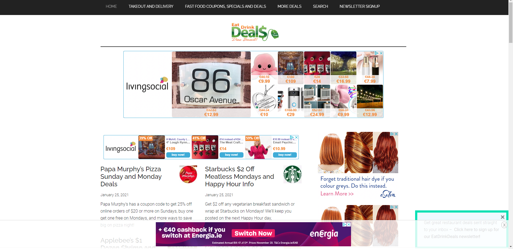

---
# Mealdeals #
---

---
## Contents ##
---

* [UX](#User-Experience)
    * [Project Goals](#project-goals)
    * [User Goals](#user-goals)
    * [User Stories](#user-stories)
    * [User Requirements and Expectations](#requirements)
    * [Design Choices](#design-choices)
        * [Fonts](#fonts)
        * [Icons](#icons)
        * [Colors](#colors)
* [Structure](#structure)
    * [Page Structure](#page_structure)
    * [Database and schema](*db_schema)
    * [Wireframing](#wireframing)
* [Features](#features)
    * [Features that have been developed](#developed)
    * [Features that will be implemented in the future](#implemented)
* [Technologies](#technologies)
* [Testing](#testing)
* [Issues](#issues)
* [Deployment](#deployment)
* [Credit](#credits)

---
---

## UX (User Experience) ##
---
---

### Project Goals ###
---

This website is designed so that restaurants can have a space to advertise thier deals, and bring foot traffic through thier doors 

The **goal** for this project is to allow restaurants the ability to advertise their restaurant and thier ideas on a platform which is not social media.  
The website also gives the restaurants the access to change thier deals without any hassle, but most important it is a place where the restaurants are charged
a flat rate for monthly subscribions instead of being "charged per voucher" bought and have a portion of their hard earned profit put towards bringing in people.

---

### User Goals ###
---

For the UX on this project I wanted to create a simple and user friendly site. My target audience is young and mature adults.  
The site also allows for restaurant customers to find good and decent deals in thier area!!

#### Scope ####
* An Eye catching landing page
* Mass-displaying all or filtered deals. Lines of relatively small images, with option to click and view or like
* Search, filter and sort deals.
* Detailed profile for restauranteurs on top of the simple registration.
* Dedicated page for uploading new deals
* Checkout with card payment.
* Full page Deal view including the Name of the restaurant, address and contact details as well as the Deal description, price and valid till, options.
* Legal framework is also included, with links to privacy policies and FAQs, as well as corporate info in the about us section of the website.

#### Clients ####
* **View specific deals** with **quick searches** within the **Category and Area** they are looking for, instead of searching through all the deals.
* **Being excited** to find new deals and **share** these deals with their friends.
* **Veiw** the full list of deals on the home page
* **Find company info** from the deal such as name of restaurant, address, telephone number, website
* **View individual deal Info** from the deal such as T&C's, price, and end time for the promotion 
* **Contact us** for expert marketing advise and we will design any deals for you at a small fee.
 

#### Restaurant Management Profiles ####
* Easily **Register & Create** a Profile, having a restaurant specific profile.
* Easily **Login or Logout** access to account infomation
* Easily **recover my password** in case I forget it.
* Recieve **an Email confirmation** to verify that my account registeration was successful.
* **Easily** pay for the subscribtion costs on signing up
* **Receive** and email confirmation of purchase to keep for records and accounting.
* **Add, Edit and Delete** Company infomation as needed in a **personalized User profile**
* **Add, Edit and Delete** Deals periodicaly

#### Out of Scope topics ####
* order processing after checkout and the bag was excluded, as one of the steps in the payment journey.
* Potential further features:

    * Coupon code for promotions,
    * Discount for multi-buys.
* Marketing the site itself and utilising advertising opportunities within the site is out of scope, therefore the links to social media sites are home based links.

---

### User Stories ### 
---

* The **Clients user** wants an **attractive website** with a **non-distracting** background.
* The **Clients user** wants to see **clear instructions** on how to drill down into further infomation on deals within the website.
* The **Clients user** wants there to be a **search box** so that the user can quickly identify **deals**.
* The **Clients user** wants to be able to **sort by** categories or restaurant name.
* The **Clients user** wants to start **finding deals immedaitely**. 
* The **Clients user** wants to see the **latest deals** added.
* The **Clients user** wants a **conveint sized deal box** to be able to read the Deal clearfully.
* The **Clients user** wants to know the **Deals** details such as **T&C's, price, and end time** for the promotion.
* The **Clients user** wants to get a maximum of advantage of the **Mealdeals cloud**.
 
* The **Admin user** wants to know the **time period** of the deal before **deciding** on continuing with the specific deal.
* The **Admin user** wants to **have the possibility** of thier **own profile** where their deals come up first.
* The **Admin user** wants to **know** if **their Deals has been submitted**.
* The **Admin user** wants to know the **deals** details such as **name of restaurant, address, telephone number, website**
* The **Admin user** wants to **easily add, edit and delete their own Deals** on the website.
* The **Admin user** wants to **have the possibility** to **upload pictures**.

---

### Research ###
---

* When developing this **website**, I kept in mind that the aesthetic should be inspired by similar Deal and coupon hubs on the internet. 
* I tried to create a **simple and easy feel** to for a cleaner approach for the landing page.
* I checked **previously made coupon websites** such as [**groupon.ie**](https://www.groupon.ie//) and used **my own experience** as a trained chef and restauranteur.

---

### Design Choices ###
---

### Fonts ###

* The **landing page** is using the classic website **Google Fonts** **#** for the H1 and H3. 
* I paired it with the **Google Fonts** **Crimson & Oswald** for readability.
* I kept the **Oswald** font for **better user experience**

### Icons and Images ###

* The **Favicon** used on the website are provided by [**Canva**](https://canva.com/) and called by using url_for.
* The **image** used for the **landing page** is a created **image** from the image bank [**Canva**](https://canva.com/). 

### Colors ###

* The **color scheme** used for the website is a sleek **deal website palette** composed of a combination of **Red and whites** 
* For the **title** and the **logo** I used a **dark burgandy red** on the **a white background**.
* I specifically chose these colors as Red is a colour at stimulates appetite in humans, but I wanted it a dark red as I still wanted to convey a relaxed atmosphere.

---
---

## Structure ##
---
---

### Page Structure ###
---

#### Filtering and browsing ####
There are two types of users and I wanted to give clear path to start using the site with Call To Action for both groups. Potential deal shoppers are directed to the Search & browsing, while potential restuaranteurs are shown an eye-catchy banner with a popping CTA button.

#### Home page ####
Many similar sites (competitors) are trying to showcase wide range of services and options, therefore loosing focus and probably loosing potential subscriptions and users by not inviting them to further explore the site. My clear goal here is to lead users to check out more deals.

#### Detailed view ####
Clicking on any of the deals on the home page brings the user to the deal details page, displaying all the available information about each deal. 

#### Potential contributors ####
Potential contributors have a flow of action to fully utilize the page and achieve their goals. They have a strictly limited access to the part of the database that concerns their artwork and therefore can perform CRUD operations.

* Create new entry: upload image and provide details
* Read (Display) entries - the detailed view with personal information
* Update entries - making changes to their existing records
* Delete entries – delete items from the database 

---

### Database and schema ###
---

---

### Wireframing ###
---
For **wireframing** I used the tool [**Balsamiq**](https://balsamiq.com/).

Please follow the link to find the preview [here] 

href = https://balsamiq.cloud/srsmfvs/pt96bgn/r7C4D

* Herewith the **wireframe** and I pushed a few changes for better readability and engagement:
* I added **a jumbotron hero image** on the landing page.
* I added **a full-screen background image** on all the other pages.
* I used a **form** to allow for the user to add & edit Deals.
* I added an easy link to **upload** videos.

### Landing Page ###

### Search results ###

### Deal Page ###

### Registeration Page ###

### Registeration Payment Page ###

### Add deal profile Page ###

### Contact us Page ###

## Features ## 
---

### Implemented Features ###

* **Responsiveness** on all screen sizes.
* **large title** for attractiveness and engagement.
* **Suggested recipes** on landing page as an introduction.
* **User login/logout** so that users can keep a tally of their own recipes added and videos uploaded.
* **Input Recipes** to the website.
* **Edit Recipes** to the website.
* **Search Recipes** on the Website.
* **Instructions** so that the user can grasp the concept immedaitely.
* **Immedaite** recipes with Easy and simple instructions to make the recipe.
* **Download success** notation when recipe has successfully saved to the database
* **upload picture** with the recipe to give people a sense of what can be acheived with their recipe.
* **upload video** allows users to upload videos of themselves creating a recipe.

### Future implemented features ###

* **Feature 1** - **Rating system** for others to be able to rate the recipe success.
* **Feature 2** - **Comment box** and **messages notifications** below the recipes for users to interact with each other.
* **Feature 3** - **Favorites** for user to quickly reference recipes they enjoyed or still want to Experiment with.
* **Feature 4** - **Input Videos** to the website.

## Technologies used ##

* [HTML](https://developer.mozilla.org/en-US/docs/Web/HTML)
* [CSS](https://developer.mozilla.org/en-US/docs/Web/CSS)
* [Javascript](www.javascript.com)
* [JQuery](https://jquery.com/)
* [Python](https://www.python.org/)

**Tools & Libraries**

* [Bootstrap](https://getbootstrap.com/)
* [Font-Awesome](https://fontawesome.com/icons?d=gallery)
* [Google fonts](https://fonts.google.com/)
* [Git](https://git-scm.com/)
* [PNGtree](https://PNGtree.com/)
* [Flask](https://pypi.org/project/Flask/)
* [Canva](https://canva.com)
* [MongoDB](https://cloud.mongodb.com/)

## Testing ##
---

*I used **pep8online.com** to test my Python code validator with no issues - http://pep8online.com/checkresult

* I tested the python code with **Python Debugger** - https://realpython.com/python-debugging-pdb/

* Also used this **Automated Testing** to test my flask applications - https://www.patricksoftwareblog.com/unit-testing-a-flask-application

* I used **Pylint** to lint my code by Linting my python code - http://pylint.pycqa.org/en/latest/

* I tested the responsiveness of the website by using the [**Google Chrome Developer Tool**](https://developers.google.com/web/tools/chrome-devtools) as well as the plug-in **Unicorn Revealer** to control my overflow and the website [**Am I Responsive**](http://ami.responsivedesign.is/). 

* I also tested my website on **different browsers and real devices** : **Iphone 6s, Ipad Pro 12", Ipad Mini, Google Chrome, Safari, Mozilla Firefox and Samsung A70.**
* I used a first **dirty version** of this project on **Gitpod** and **refactored** my code **step by step** to remove any **useless classes**
* I tested my CSS file and my HTML files using [**CSS Validator**](https://jigsaw.w3.org/css-validator/) and [**HTML Validator**](https://validator.w3.org/) then fixed the issues needed to be fixed.

* I tested every **functions** of my script.js using multiple **console.log** and checking for **errors** in the **Google Chrome console**.
* I passed my deployed app through **Lighthouse** with the follwoing results

* All pages passed the HTML,CSS and Python validator final test with no major issues.

**Responsiveness**

* **Implementation** 

    * I used **Bootstrap** as well as **flexbox and custom CSS media queries** to ensure that the website didn't break on all screen sizes.

**Landing Page**

* **Implementation** 

    * I wanted to keep it clean and neat with the landing page displaying the newest and latest recipes. 
    * The UI has been created in HTML5 and CSS3 and by using bootstrap all tiles are responsive on all screen sizes. 
    * As stated above, I wanted to recreate a neighbourhood profile where friends, neighbours and relatives can swap and share their favourite recipes, simply and easily 
    * User does not have to register if they just want to veiw recipes all recipes are free. 
    * Landing page was responsive and working as expected 

**Add register**

 

* **Implementation**

    * To start adding your own recipes you would need to register. 
    * Once registered you would have to log in 
    * User is informed if registeration is successful if flash message appears "user successfully added" else flashes "user name already used" 
    * Register and Log-in page was responsive and working as expected 

**Profile for normal users**

 
 

* **Implementation**

    * This is where the real fun begins, as a user you can  
        1. Thier **own profile** where their recipes come up first.  
        2. **Easily Add and Edit their own recipes** to the website.  
        3. **Have the possibility** to **upload pictures**  
        4. **Easily Delete their own recipes** if they no longer want to be on the website.  
    * Profile page was responsive and working as expected 

**Profile for Admin**

 

* **Implementation**

    * This is where the Admin can see the listings page 
        1. Admin also has thier **own profile** where their recipes come up first.  
        2. From Listings Admin can **Easily Add and Edit all recipes** on the website.  
        3. **Have the possibility** to edit **upload pictures** which do not subscribe to the user agreement on the page  
        4. **Easily Delete any recipes** if the recipe does not prescribe to the user agreement and is no longer allowed on the website.  
    * Admin page was responsive and working as expected 

**Add recipes & Edit Recipes**

 
 

* **Implementation**

    * Both the add_recipe and the edit_recipe, have the same framework and based on the same template.  
    * edit_recipe does however pulls all the values from the DB so that User is aware what recipe they are editing  

    * This is the second step of the **CRUD** functionality, users can Add or edit the following:  
        1. Recipe name  
        2. Category  
        3. Prep time  
        4. Cooking Time  
        5. Difficulty  
        6. Serves  
        7. Ingredients  
        8. Add ingredient fields (add more then one or extra fields)  
        9. Instructions  
        10. Add Instructions fields (add more then one or extra fields) 

    * Also I have added a button for the user tochange mind and go back to profile.  
    * add_recipe and the edit_recipe pages was responsive and working as expected 

## Issues ##
---

**During development**

* I had a major issue with my MongoDB file whilst setting up the database because of this issue:  

**Issues**

I did not understand what was going on as my form was good and allowing me to add into the fields,  however when I submitted it was not sending it to the
database and saving it in the collections?

* To understand the error I went thorugh the code again and fixed it by creating "action" in the form to allow the method to "POST", later refactoring "input" to "add_recipes" for simplified reading 
* Then I refactored the code for one value such as ingredient & instruction, this name creates an array. This solved the issue for multiple variables to be added into the Database and when called listing all items in the array, and not seperating the values out as individual strings.  
* I also refactored the uppercase to lowercase, plurals and used_ to_seperate the variables wording rather. I refactored the numerical data into Intergers by using the int() option in python.  
* I also added timestamps and created_by to reference when the user is logged on, timestamps to allow the users to see the latest recipe added and created_by for users to veiw all their own recipes in their profile.  

I was having an issue with the search elements once I had refactored the code for add_recipe and edit_recipe. Pagination being a big error, as I had added pagination to the index page.

* After many attempts I decided to rather add a seperate html dedicated to search results instead trying to forced the system to display the index page.  
* Once fixed the search was not bearing any results, very confused as no errors were appearing. Thus I assumed the issue must lie with the query.  
* And yes, I had forgotten to refactor the orginal indexes in MongoDB, how the user is able to search mulitple questions, name, category, ingredient and even any instruction.  

I also has few errors passing through my GitPod, basic house cleaning fixed most of the issues very quickly

After my mentor call and my peer-code-review I realized that I needed to add some comments via Docstring for understanding of my code.  
and used this website to assist me Docstring conventions - https://www.python.org/dev/peps/pep-0257/  

## Deployment ##
---
**RecipeCloud** was developed on **GitPod**, using **GitHub** to host the repository and deployed on **GitHub Pages**.
**Heroku** made the deployment extremely painless:

* Connect to [**Heroku**](https://dashboard.heroku.com/apps)
* Click new/ **create new APP**
* Add the new app name and choose a region, In my case **Europe**
* While the app is being generated you will need to **Config Vars** by going to **settings**
* Config vars change the way your app behaves. In addition to creating your own, some add-ons come with their own
* In **Config vars** you need to add the **ID,PORT,MONGODB_NAME,MONGO_URI,SECRET_KEY**
* Now to **Deploy** find deployment method choose **GitHub** sign into your GitHub.
* Selected the repository **JustWhittaker/PRO3-RecipeCloud**
* In the **GitHub Pages** I selected **Master Branch** and **/root** in the dropdown menu and clicked **Save**
* Click on **"Automatic Deploys"** below 
* I waited 2 minutes.
* **The website is now live on https://recipe-cloud-pro.herokuapp.com/**.

**Cloning** No issues:

* Why do we is it important to be able to clone successfully first **Collaboration** with team members if you are working in a scrum and secondly **Assist** other developers to use my main project to grow their own version.
* In my repository **JustWhittaker/PRO3-RecipeCloud**, click on the **"Code** green button, **copy in clipboard the HTTPS link**, open your **IDE** and look through my files.
* The link : **https://github.com/JustWhittaker/PRO3-RecipeCloud.git**

## Credits ##
---

**Text Credits:**

* All text content has been written by Justin Whittaker.

I received inspiration and technical knowledge for this project from the following platforms
1. Bootstrap  
https://mdbootstrap.com/docs/standard/forms/input-fields/ 
https://getbootstrap.com/docs/4.3/components/card/ 
https://getbootstrap.com/docs/4.3/components/dropdowns/ 
https://www.w3schools.com/bootstrap/bootstrap_ref_css_images.asp  
https://www.w3schools.com/bootstrap4/bootstrap_navbar.asp  
https://stackoverflow.com/questions/10099422/flushing-footer-to-bottom-of-the-page-twitter-bootstrap#:~:text=The%20simplest%20technique%20is%20probably,the%20footer%20to%20the%20bottom.

2. Django Basics  
https://docs.djangoproject.com/en/3.1/intro/tutorial01/ 
https://www.ordinarycoders.com/blog/article/build-a-django-contact-form-with-email-backend 
https://stackoverflow.com/questions/21938028/how-can-i-get-a-favicon-to-show-up-in-my-django-app 
https://www.geeksforgeeks.org/python-uploading-images-in-django/ 
https://stackoverflow.com/questions/36665889/collectstatic-error-while-deploying-django-app-to-heroku

3. Python research  
    1. CodeInstitute Django Fundamentals  
    2. https://randomkeygen.com/  
    3. Docstring conventions - https://www.python.org/dev/peps/pep-0257/  

4. Better Git Commit terms  
http://karma-runner.github.io/5.0/dev/git-commit-msg.html

5. Dependencies  
    1. Django  
    2. JQuery (html js middleware)  
    3. bootstrap  

6. Other platforms  
https://policymaker.io/privacy-policy-ready/  
https://favicon.io/favicon-generator/  
https://devcenter.heroku.com/articles/heroku-postgresql#connecting-in-python 

**Many thanks to:**

* My mentor **Ignatius Ukwuoma** for his patience and kindness
* **AudreyLL88** for her very inspiring ReadME
* **Code Institute Slack community** for the technical and emotional support
* **Code Institute Tutors** Cormac, Tim, Sam, Johann and Milkos were fantastic help
* **Alishia Whittaker**, for the Graphic design and stock images from Canva and your support through all my studies

**Site for educational purposes only!**