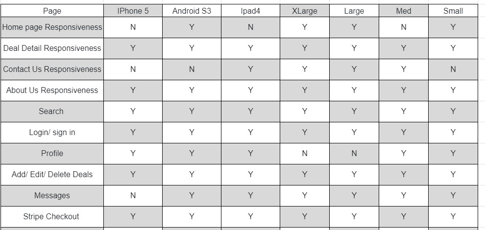
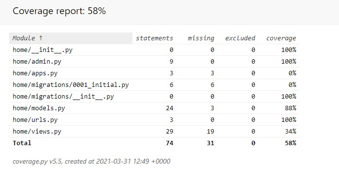
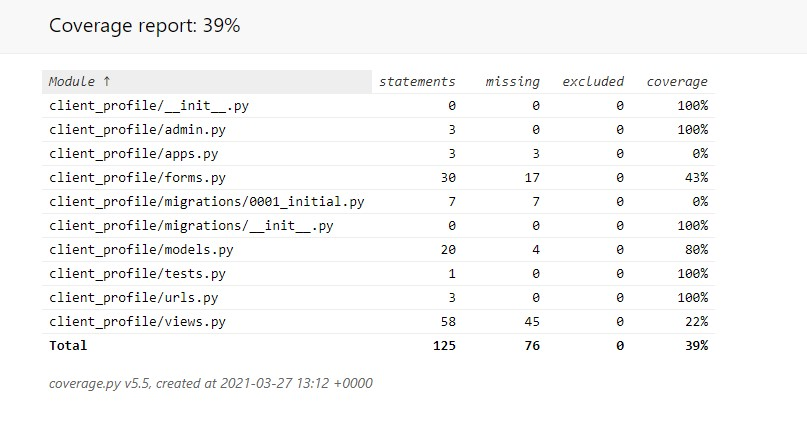
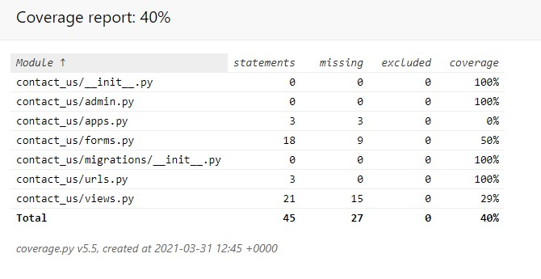
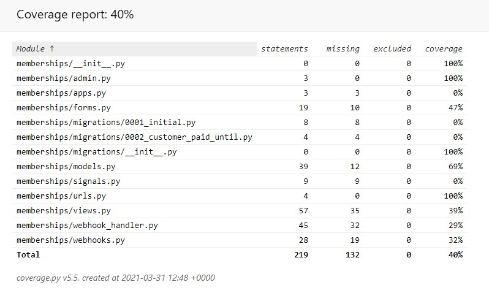

---
# Mealdeals Testing #
---
## Contents ##
---

* [Testing](#Testing)
    * [Validation Testing](#ValidationTesting)
    * [Unit Testing](#UnitTesting)
    * [Cross Browser/Cross Device Verification](#CrossBrowser)
    * [Python Tests](#PythonTests)
    * [Troubleshooting](#Troubleshooting)
    * [Outstanding Defects](#OutstandingDefects)

---

## Testing ##
---

---

### Validation Testing ###
---
* [**CSS Validator**](https://jigsaw.w3.org/css-validator/) - Note, any error associated with root: Imported style sheets are not checked in direct input and file upload modes were ignored.
* [**HTML Validator**](https://jigsaw.w3.org/css-validator/) - validation of HTML with Django is pretty useless as all {{}} bracketed values raise errors. I ran only a few files through the validator and instead relied heavily upon gitpod's IDE to identify mismatched tags and closing Django directives.
* [**django-extensions**](https://pypi.org/project/django-extensions/) - used for validating templates from the command line python manage.py validate_templates
* [**JavaScript Validator**](https://beautifytools.com/javascript-validator.php) Note any errors for let, variables set in other .js files, and constants were ignored. 
* [**GitPod IDE**](https://gitpod.io/) - Gitpod has inline validation for many file types. Python, CSS, HTML, DJANGO files were continuously tested for validity when using this IDE.

---

### Unit Testing ###
---

As core functionality and features were delivered I attempted to create python tests to ensure functionality was not lost. I got behind after a point, but made up ground at the end to get some coverage of all models, forms and views.

Testing user stories
**Client user**
* The **Clients user** wants an **attractive website** with a **non-distracting** background.
    * Expected to be responsive on the landing page and user drawn into the deals 
        * As you drop onto the site it draws me into the deals as they pop up from the clean background
        * The site acted as expected

* The **Clients user** wants to see **clear instructions** on how to drill down into further information on deals within the website.
    * Expected to have clear visuals and can click onto the image to load 
        * The deals are responsive and clearly shows the ability to click on the link to veiw further information
        * The site acted as expected

* The **Clients user** wants there to be a **search box** so that the user can quickly identify **deals**.
    * Expected to have clear visuals and can quickly narrow down into the different deals by field 
        * Search bar is responsive and quickly searches and filters out any irrelevant deals.
        * The site acted as expected

* The **Clients user** wants to start **finding deals immediately**. 
    * Expected user drawn into the deals immediately
        * As you drop onto the site it draws me into the deals as they pop up from the clean background
        * The site acted as expected

* The **Clients user** wants to see the **latest deals** added.
    * Expected user drawn into the deals immediately with the latest deals appearing
        * As you drop onto the site it draws me into the deals as they pop up from the clean background
        * The site acted as expected

* The **Clients user** wants a **convenient sized deal box** to be able to read the Deal clearfully.
    * Expected to that deal box doesnt break through veiws on different devices 
        * checked and formulated a checklist view below under CrossBrowser verification, some areas needed fixing on the CSS but manage to do this easily with the help of the spreadsheet
        * The site acted as expected

* The **Clients user** wants to know the **Deals** details such as **T&C's, price, and end time** for the promotion.
    * Expected to have clear pathways to find all the details on the page including extra info about us and contact and FAQs 
        * As you drop onto the site all the info is clearly listed in the footer and the nav bar, likewise the deal detail page gives you additional info the admin user has added
        * The site acted as expected

* The **Clients user** wants to get a maximum of advantage of the **Mealdeals cloud**.
    * Expected to be able to view all the deals on the site 
        * All deals are visible on the landing page
        * The site acted as expected

**Admin user**

* The **Admin user** wants to **have the possibility** of their **own profile** where their deals come up first.
    * Expected to be able to veiw all own profiles in the profile veiw 
        * All deals appear in the Profile page along with the ability to quickly guide yourself into the CRUD functionality or veiw in detail and return back to the Profile.
        * The site acted as expected

* The **Admin user** wants to **know** if **their Deals has been submitted**.
    * Expected to show messages of success, errors, caution and cancellations 
        * all messages are working correctly and display at the correct time 
        * The site acted as expected

* The **Admin user** wants to know the **deals** details such as **name of restaurant, address, telephone number, website**
    * Expected to be be able to load, edit and delete CRUD functionality for their business info
        * add and edit business info has the functionality to ensure that adding, editing and deleting info is simple and easy
        * The site acted as expected

* The **Admin user** wants to **easily add, edit and delete their own Deals** on the website.
    * Expected to be be able to load, edit and delete CRUD functionality for their deals
        * add and edit deal has the functionality to ensure that adding, editing and deleting deals is simple and easy
        * The site acted as expected

* The **Admin user** wants to **have the possibility** to **upload pictures**.
    * Expected to be be able to load good size photos 
        * add and edit deal has the functionality to ensure photo upload
        * The site acted as expected

---

### Cross Browser/Cross Device Verification ###
---

To verify that the application is functional and looks pleasant across various operating systems and device sizes
These tests are light on the functionality with more attention being paid to the layout and console logs:

Operating systems and screen sizes is as follows:

I would say after creating this form I have been able to fix 99% of the responsiveness and turned alot of the No's into a Yes!

---

### Python Tests ###
---

Tests were written for Django views, forms, models. These files are located in each application specific /test folders and named in the following manner:

* test_forms.py - for tests concerning forms
* test_models.py - for tests concerning models
* test_views.py - for tests concerning views

I focused Alot of time on the code itself ensure that I wrote good and clean code and simply ran out of time to ensure that I complete a 100% Coverage on my tests.

#### COVERAGE REPORTS ####

**home**

**client_profiles**

**contact_us**

**memberships**

---

## Troubleshooting ##
---

As I had a few learning curves by using Django frameworks there were a lot of errors I needed to work through and understand, I wanted to document a lot of my learning opportunities through this project. See the separate [ERRORS.md](ERRORS.md) file for the details.

---

### Outstanding Defects ###
---

Takes a while to get to the next page when uploading files - I should add in a file processing status bar so user's know what is going on. The static state of the selected submit button is some visual indicator but I should prevent user input during this wait.

Inefficient Email - I should use a celery task or distributed system to handle emailing users. Right now it's all inline and not done asynchronously thus adding to the time it takes to create a contact form.

No system timeout - User's login seems to last forever, should auto log users out after half an hour to keep accounts secure
